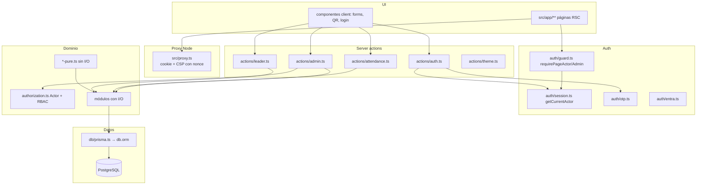
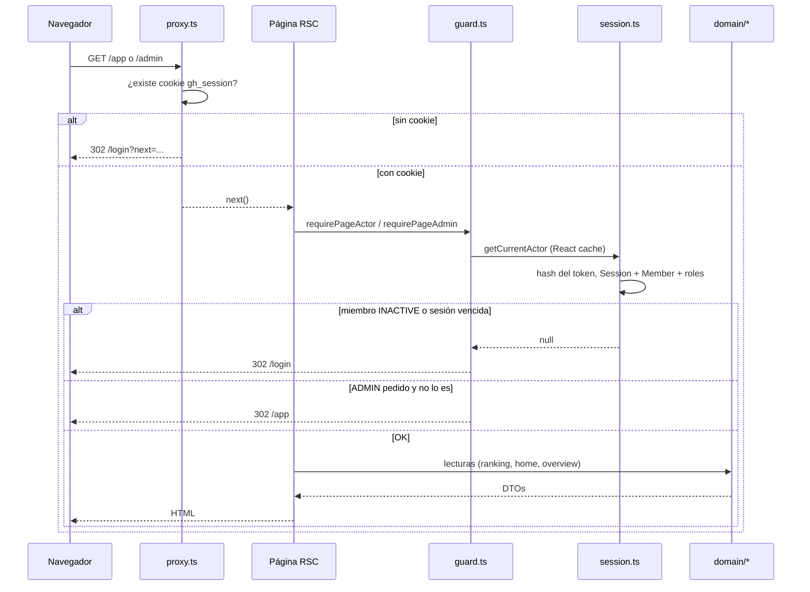
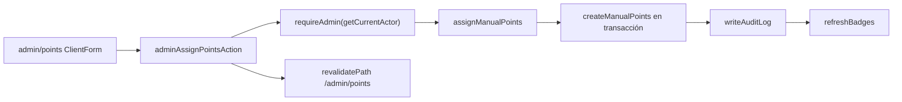

# Arquitectura

GH Points es una aplicación **Next.js 16 (App Router) + React 19 + TypeScript** con **PostgreSQL 18** vía **Prisma**. No hay capa REST genérica de CRUD: la mutación del dominio entra por **server actions** (formularios) o por **pocas rutas API** (auth Entra, health, export, import Forms).

## Capas

| Capa | Dónde | Qué puede hacer | Qué no debe hacer |
| --- | --- | --- | --- |
| Páginas RSC | `src/app/**` | Leer vía módulos de dominio (`member-reads`, `leader-reads`, `analytics`) y renderizar | Consultar la base directo (regla de `CONTEXT.md`: vistas de integrante/líder no tocan la base) |
| Componentes client | `src/components/**` | Enviar `FormData` a server actions, transiciones UI | Autorizar o calcular puntos |
| Proxy (Node) | `src/proxy.ts` | Redirigir a `/login` si una ruta protegida no tiene cookie `gh_session`; conservar pathname y query; emitir la CSP con nonce por request | Validar sesión, roles o estado del integrante (ADR-010) |
| Server actions | `src/server/actions/**` | Parsear FormData, `requireAdmin` / `requireActor`, llamar dominio, `revalidatePath` | Reimplementar reglas |
| Auth | `src/server/auth/**` | OTP, magic link, Entra, cookie, `Actor` | Crear integrantes al login |
| Dominio | `src/server/domain/**` | Invariantes, ledger, scoring, auditoría | Conocer cookies o Tailwind |
| Config | `src/server/config/**` | Env Zod y `AppConfig` | Secretos en el cliente |
| Lib | `src/lib/**` | Fechas TZ, `publicId`, slug, constantes de cookies | I/O de base de datos |

Los archivos `*-pure.ts` (`scoring-pure`, `ranking-pure`, `badges-pure`, `levels-pure`, `hall-of-fame-pure`, `entra-pure`) no importan el cliente de datos ni `server-only`. Los tests unitarios los cubren sin base de datos. Vitest aliasa `server-only` a `tests/empty.ts` para poder importar módulos de dominio en Node.

## Flujo de un request autenticado

`getCurrentActor` está envuelto en `React.cache`, así que layout + página del mismo render comparten una sola lectura de sesión.

## Proxy vs autorización

`src/proxy.ts` (convención de Next 16; antes `middleware.ts`, deprecada) solo mira si existe la cookie `SESSION_COOKIE` (`gh_session` en `src/lib/constants.ts`) para redirigir accesos sin cookie a `/app` y `/admin`. No redirige `/login` por la mera presencia de una cookie: la página valida la sesión, lo que evita un bucle con cookies vencidas o inválidas. Su matcher es amplio —todo menos la salida estática de Next y los archivos de imagen— porque además emite la CSP con nonce en cada documento (ADR-022). Corre en runtime Node, no Edge.

- `/app` y `/admin` sin cookie → `/login?next=<pathname+query>`.
- `/login` consulta `getCurrentActor`: sesión válida → destino seguro o área por rol; cookie inválida → formulario normal.
- `/a/[publicId]`, `/hall-of-fame`, `/api/*` no reciben el redirect de autenticación del proxy. La página pública de actividad redirige ella misma a login; las API validan admin o bearer.

La autorización real vive en `src/server/domain/authorization.ts` (`requireActor`, `requireAdmin`, `requireCommitteeLeader`) y en `src/server/auth/guard.ts` para páginas.

## Server actions vs rutas API

**Server actions** (`"use server"`) son el camino principal de mutación:

| Archivo | Rol |
| --- | --- |
| `src/server/actions/auth.ts` | Pedir OTP, verificar, consumir magic link, logout |
| `src/server/actions/attendance.ts` | Registrar asistencia por `publicId` |
| `src/server/actions/admin.ts` | CRUD admin: integrantes, comités, temporadas, actividades, puntos, import, QR, config |
| `src/server/actions/leader.ts` | Proponer actividad `DRAFT` |
| `src/server/actions/theme.ts` | Cookie `gh_theme` |
| `src/server/actions/form-parse.ts` | `str` / `strs` / `num` / `parseEnum` |

Patrón admin: `runAdminAction` obtiene actor, exige ADMIN, IP, ejecuta handler, `revalidatePath`. Errores de dominio se convierten con `toUserMessage`.

**Rutas API** (pocas, con motivo):

| Ruta | Por qué no es action |
| --- | --- |
| `GET /api/health` | Probe sin sesión |
| `GET /api/auth/entra/start` y `callback` | Redirect OIDC |
| `GET /api/admin/export/[type]` | Descarga CSV/XLSX |
| `POST /api/import/forms` | Power Automate / bearer `IMPORT_SECRET` |

No existen ya las rutas `/api/members`, `/api/events`, `/api/committees` del prototipo.

## Dónde vive la lógica vs la UI

- **Puntos, asistencia, score de comité, badges, temporada:** solo `src/server/domain/*`.
- **Mutación administrativa + auditoría:** una sola `db.transaction`; `writeAuditLog` siempre recibe `tx`. Los locks de temporada/actividad y la revalidación viven en dominio.
- **Quién puede mutar:** `authorization.ts` + `requireAdmin` al inicio de cada función de dominio sensible (no basta el layout).
- **Lecturas de integrante:** `member-reads.ts` (home, perfil, listado de actividades). Las páginas `/app` no importan el cliente de datos.
- **Lecturas de líder:** `leader-reads.ts`. El roster **omite email** (ADR-014).
- **Overview admin:** `analytics.ts` sí usa Prisma (KPI, SQL semanal).
- **UI:** páginas RSC + `ClientForm` / botones client. `src/components/ui/*` es shadcn (Input, Button, Tabs, etc.). Bloques de producto: `ui-blocks.tsx`, `podium/podium.tsx`.

## Request de mutación (ejemplo: asignar puntos)

El ledger nunca se edita: una corrección es otra fila `REVERSAL` o `MANUAL_ADJUSTMENT`.

## Infra transversal

| Pieza | Archivo | Notas |
| --- | --- | --- |
| Prisma singleton | `src/prisma/db.ts` reexportado en `src/server/db/prisma.ts` | Reuso en HMR vía `globalThis` |
| Unique Postgres | `src/server/db/errors.ts` | `sqlState === "23505"` → idempotencia |
| Errores de dominio | `src/server/domain/errors.ts` | `DomainError` + códigos |
| Email | `src/server/email/sender.ts` | Resend si hay API key; si no, consola |
| Notificaciones | `src/server/notify/events.ts` | Email + Teams fire-and-forget; fallo no revierte dominio (ADR-020) |
| Tema | cookie `gh_theme`, layout lee y pone `class="dark"` | Persistido 1 año |
| Lint | ESLint Next + Oxlint anti-slop | `tools/oxlint/anti-slop` |

## Config de Next

`next.config.ts` marca `@prisma/orm-postgres`, `pg` y `prisma` como `serverExternalPackages` y fija `turbopack.root` al directorio del repo.

`tsconfig.json` mapea `@/*` → `src/*`, `strict: true`. Excluye `tools/oxlint`.

## Semillas de diseño (ADR)

La arquitectura concreta las ADR de `docs/decisions.md`: Prisma+Postgres, auth propia, ledger inmutable, una temporada `ACTIVE`, score relativo de comité, `publicId` en QR, autorización en Node no en Edge, líder que propone y no aprueba, email adapter, timezone Bogotá, privacidad en rankings, Entra opcional, notificaciones sin tracking.
