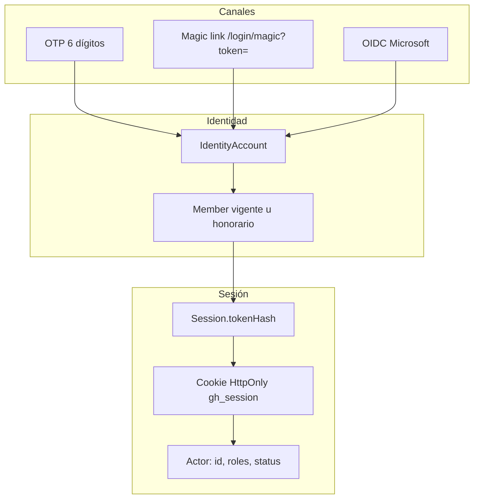
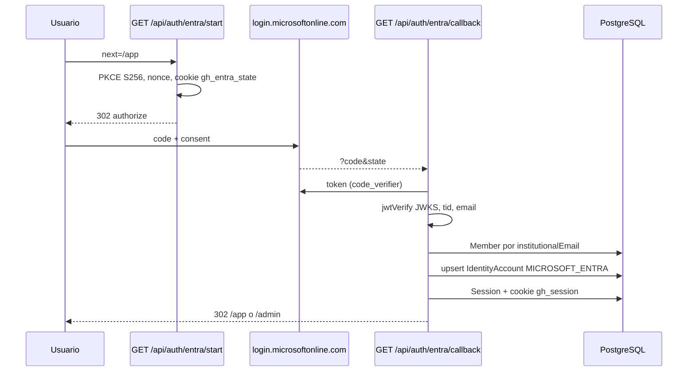

# Autenticación y autorización

La identidad de negocio es `Member`. Los proveedores (`IdentityAccount`) no sustituyen al integrante: si el correo no está en el roster, **no se crea** una cuenta al hacer login (OTP ni Entra).

ADR-002 / ADR-010 / ADR-016 / ADR-019. Guía operativa de Entra: [`docs/entra-sso.md`](../entra-sso.md).

## Visión general

Login: vigente (`ACTIVE`) y honorario (`HONORARY`). Ranking, badges y denominador de comité: solo vigente. Licencia y retiro destruyen sesiones.

`email_otp` **siempre** está habilitado como fallback (`getEnabledAuthProviders` antepone `email_otp` si falta en `AUTH_PROVIDERS`). Entra solo aparece si `AUTH_PROVIDERS` incluye `entra` **y** están `ENTRA_CLIENT_ID`, `ENTRA_CLIENT_SECRET`, `ENTRA_TENANT_ID`.

## Dominio institucional

`INSTITUTIONAL_EMAIL_DOMAINS` (coma-separado) en `src/server/config/env.ts`. `src/server/auth/email.ts`:

- `normalizeEmail`: trim + minúsculas.
- `isAllowedEmailDomain`: igualdad exacta del dominio tras `@` (no subdominios implícitos).

Crear integrante o completar Entra rechaza otros dominios (`INVALID_EMAIL_DOMAIN`).

## OTP y magic link

Archivos: `src/server/auth/otp.ts`, `src/server/auth/secrets.ts`, `src/server/auth/identity.ts`, `src/server/actions/auth.ts`, `src/server/email/sender.ts`.

### Pedir acceso (`requestOtp`)

1. Normaliza y valida dominio.
2. Rate limit (ventana 15 min): máximo **5** retos `kind=OTP` por email, **12** por IP (`x-forwarded-for` o `x-real-ip`).
3. Si no hay `Member` ACTIVE con ese correo, retorna `{ delivered: false }` **sin error**. El action `requestOtpAction` igual responde `ok: true` y el formulario pasa al paso del código. Así no se enumera el roster.
4. Si existe: genera código de 6 dígitos y token mágico (32 bytes hex).
5. Inserta **dos** `AuthChallenge` (OTP + MAGIC_LINK), mismo `expiresAt` (`OTP_TTL_SECONDS`, default 600).
6. Un solo correo (`buildLoginEmail`): código + enlace `{APP_URL}/login/magic?token=...`.

Código OTP:

- Producción: `randomInt` 000000–999999.
- No producción: si `OTP_FIXED_CODE` está definido, usa ese valor (E2E / seed).

Hashes (`secrets.ts`):

- OTP: `SHA-256(SESSION_SECRET:email:code)`.
- Magic: `SHA-256(MAGIC_LINK_SECRET:token)`; si `MAGIC_LINK_SECRET` está vacío, se usa `SESSION_SECRET`.
- Comparación: `timingSafeEqual` con misma longitud (`safeEqual`).

### Verificar OTP / consumir magic link

- OTP: último reto `OTP` no consumido de ese email. Expirado → `OTP_EXPIRED`. `attempts >= maxAttempts` (5) → `OTP_RATE_LIMITED`. Fallo incrementa `attempts`.
- Magic: busca por `codeHash` del token. Token de menos de 16 caracteres se rechaza.
- Éxito: `consumeChallengesAndLoadMember` consume **todos** los retos abiertos de ese email (ADR-016), upsert `IdentityAccount` `EMAIL_OTP` / `providerUserId=email`, `lastLoginAt`.
- Integrante en licencia, retirado o desaparecido → `MEMBER_INACTIVE`. Honorario sí inicia sesión.

Luego `completeEmailOtp` / `consumeMagicLinkLogin` crean sesión y cookie.

### UI

- `/login` → `LoginForm`: paso email (`requestOtpAction`) luego código (`verifyOtpAction`). Botón Microsoft si `isEntraLoginEnabled()`.
- `/login/magic` → `MagicLinkConsumer` dispara `consumeMagicLinkAction` en `useEffect`.
- Redirect post-login: `next` debe empezar por `/`. Si el miembro es ADMIN y `next` es `/app` o `/`, va a `/admin`.

## Entra SSO (OIDC)

Archivos: `src/server/auth/entra.ts`, `entra-pure.ts`, `src/app/api/auth/entra/start/route.ts`, `callback/route.ts`.

Detalles:

- Scopes: `openid profile email`. **No** Graph / `User.Read.All`.
- Redirect: `{APP_URL}/api/auth/entra/callback`.
- State firmado: payload base64url + HMAC-like `SHA-256(SESSION_SECRET:entra:payload)` en cookie `gh_entra_state` (HttpOnly, 10 min). El `state` query es el `nonce`.
- PKCE: `code_verifier` en el state; challenge SHA-256 base64url.
- `id_token` verificado con JWKS del tenant, `aud` = client id, `nonce` debe coincidir y `iss` debe ser exactamente el issuer v2 de uno de los tenants permitidos.
- `isEntraTidAllowed`: si hay `ENTRA_ALLOWED_TIDS`, el `tid` del token debe estar en la lista. Si el tenant env es `organizations` o `common` **sin** allowlist → rechazo. Si es un GUID de tenant, el `tid` debe coincidir.
- Email: `email` || `preferred_username` || `upn` (`entraEmailFromClaims`). Debe ser dominio institucional.
- Matching: `Member.institutionalEmail`. No hay JIT provisioning.
- `providerUserId` Entra = `oid`.
- Fallo: redirect a `/login?error=...` y el OTP sigue disponible.

Los destinos post-login pasan por `safePostLoginPath`: solo acepta rutas same-origin y excluye `/login` y `/api/auth`, evitando open redirects y bucles de autenticación.

`GET /api/auth/entra/start` sin Entra configurado → `/login?error=entra`.

## Sesiones

`src/server/auth/session.ts`.

- Token: 32 bytes hex. En DB: SHA-256. Cookie `gh_session`: HttpOnly, `SameSite=lax`, `Secure` en production, `path=/`, expira en **14 días**.
- `getCurrentActor`: lee cookie → busca sesión → si venció la borra; si el miembro no puede autenticarse (`canAuthenticate`: vigente u honorario) borra **todas** sus sesiones.
- `Actor`: `id`, `fullName`, `institutionalEmail`, `memberType`, `status`, `sessionId`, `roles[]` (`role` + `committeeId`).
- Logout: borra fila + cookie vacía (`logoutAction`).
- Inactivar integrante: `destroyMemberSessions`.

La cookie **no** es prueba de autorización (ADR-010).

## Guards de página

`src/server/auth/guard.ts`:

- `requirePageActor`: `requireActor(getCurrentActor())`; 401 de dominio → `redirect("/login")`.
- `requirePageAdmin`: actor + `isAdmin`; si no, `redirect("/app")`.

Usados en `src/app/app/layout.tsx` y `src/app/admin/layout.tsx`. Un MEMBER que adivine `/admin` ve el layout redirigir a `/app`. Las actions admin vuelven a llamar `requireAdmin`.

## RBAC

`src/server/domain/authorization.ts`.

| Rol | Cómo se asigna | Puede | No puede |
| --- | --- | --- | --- |
| `MEMBER` | Al crear integrante | Ver `/app`, registrarse en actividades abiertas, ver rankings/perfil/HoF | Mutar puntos, aprobar asistencias, ver roster de comité ajeno |
| `COMMITTEE_LEADER` | Admin marca comités en ficha del integrante | Ver roster (sin email) y scores de **sus** comités; proponer `DRAFT` | Publicar, asignar puntos, aprobar/rechazar asistencias |
| `ADMIN` (GH General) | Checkbox en ficha | Todo lo de admin + vista de líder de cualquier comité | Quitar el último ADMIN |

Helpers: `hasAdminRole`, `isAdmin`, `ledCommitteeIds`, `isCommitteeLeader`, `canViewCommitteeRoster`, `canOpenLeaderArea`, `canProposeActivity`, `requireCommitteeViewer`, `requireCommitteeLeader` (ADMIN bypass).

`COMMITTEE_LEADER` sin `committeeId` se ignora en `ledCommitteeIds`.

Nav `/app`: el enlace «Comité» solo si `canOpenLeaderArea`. El botón Admin en header solo si `isAdmin`.

## Secretos y cookies

| Variable / constante | Uso |
| --- | --- |
| `SESSION_SECRET` | Obligatoria ≥16 chars. Hash OTP, hash sesión, firma state Entra, hash token de asistencia |
| `MAGIC_LINK_SECRET` | Opcional; fallback `SESSION_SECRET` |
| `ENTRA_CLIENT_SECRET` | Token OIDC |
| `IMPORT_SECRET` | Bearer de `POST /api/import/forms` |
| `RESEND_API_KEY` | Si vacío, email a consola |
| Cookie `gh_session` | Sesión |
| Cookie `gh_entra_state` | State OIDC |
| Cookie `gh_theme` | `light` \| `dark` (no es auth) |

`OTP_FIXED_CODE` **no** es un secreto de producción: se ignora si `NODE_ENV === production`.

Tokens de asistencia (QR dinámico): `hashAttendanceToken(activityId, token)` = SHA-256 de `SESSION_SECRET:att:{activityId}:{token}`. El token en claro (base64url 18 bytes) se muestra una vez al rotar; no se persiste.

## Rate limit (deuda consciente)

El límite de OTP es contar filas `AuthChallenge` en Postgres, no Redis (`docs/backlog.md`). No hay rate limit distribuido entre instancias más allá de esa tabla.
