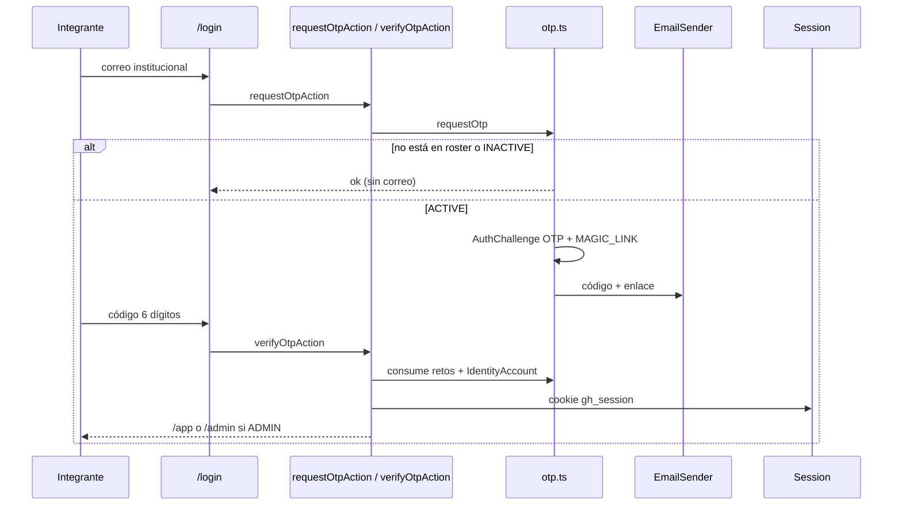
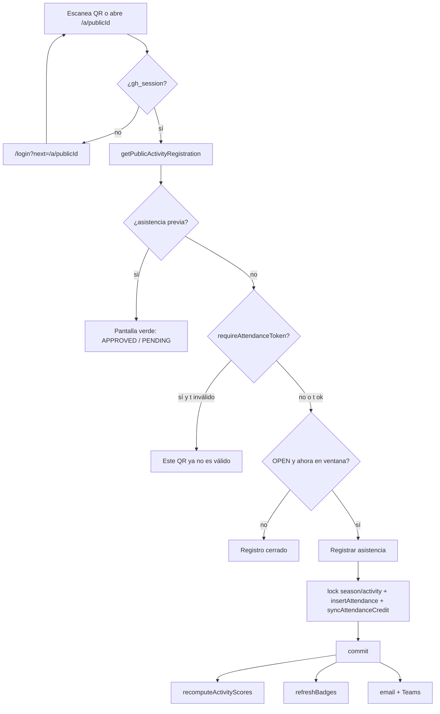

# Flujos de usuario

Flujos extremo a extremo según el código actual. Los nombres de dominio coinciden con [`CONTEXT.md`](../../CONTEXT.md).

## Login (OTP + magic link)

El enlace `{APP_URL}/login/magic?token=` llama `consumeMagicLinkAction`. Consumir OTP o enlace invalida el otro. En desarrollo, `OTP_FIXED_CODE=123456` y el adapter de consola imprimen el correo.

Si Entra está encendido, el botón redirige a `/api/auth/entra/start`. Detalle en [autenticacion-y-autorizacion.md](./autenticacion-y-autorizacion.md).

## Registrar asistencia (QR estático / dinámico / publicId)

- URL pública: `/a/{publicId}`. El id interno no se expone en el QR (ADR-009).
- **QR estático:** `APP_URL/a/{publicId}` generado en admin con la librería `qrcode`. Regenerar (`rotateActivityPublicId`) cambia `publicId` y archiva el anterior: el cartel viejo deja de resolver (`getActivityByPublicId` busca el vigente).
- **QR dinámico:** admin activa token; el enlace es `/a/{publicId}?t={token}`. El estático **deja de registrar** (`assertAttendanceToken`). Rotar emite un token nuevo; el anterior falla el hash. El token no se vuelve a mostrar.
- `approvalMode=AUTO`: status APPROVED y fila `ACTIVITY` en el ledger en la misma transacción.
- `MANUAL`: PENDING, sin puntos hasta que un ADMIN apruebe.
- Duplicado: unique `(activityId, memberId)` → «Ya registraste tu asistencia.»
- Temporada CLOSED o actividad no OPEN: error de dominio.

Admin puede añadir asistencia a mano o masiva (`bulkAwardActivity`) sin ventana de registro, pero solo cuando la actividad está OPEN o CLOSED.

## Ciclo y cancelación de actividad

El detalle admin ofrece comandos contextuales, no un selector libre: DRAFT→OPEN, OPEN→CLOSED y CLOSED→PROCESSED. No hay reapertura. El procesamiento falla mientras quede una asistencia PENDING.

Cancelar exige un motivo. Bajo un único bloqueo/transacción se cambia la actividad, se cancelan asistencias PENDING/APPROVED, se crea una REVERSAL por cada crédito vivo y se audita la actividad y cada asistencia. REJECTED/CANCELLED se conservan. Repetir el comando sobre una actividad ya cancelada no duplica reversión ni auditoría.

La edición se reduce con el avance: todos los campos en DRAFT; metadatos y fechas en OPEN; solo nombre/descripción en CLOSED; solo lectura en PROCESSED/CANCELLED.

## Aprobación administrativa

`/admin/attendance` admite filtros URL `q`, `committee` y `activity`; `q` busca nombre o correo institucional. El correo aparece en estas superficies admin, nunca en rankings ni roster de líder.

En la bandeja global y el detalle de actividad se pueden seleccionar filas visibles, comprobar el contador anunciado por lector de pantalla y aprobar/rechazar únicamente la selección. “Aprobar todos” y “Rechazar todos” son acciones separadas con confirmación. El servidor vuelve a validar permiso, temporada, actividad, estado y cada asistencia; un id inválido revierte el lote completo.

## Otorgar y revertir puntos

1. **Por asistencia:** automático al pasar a APPROVED (`individualPoints`).
2. **Manual:** `/admin/points` → `assignManualPoints`. Motivo obligatorio. Negativo → tipo `PENALTY`.
3. **Masiva por actividad:** checkboxes de integrantes → asistencias APPROVED + crédito de la actividad.
4. **Reversión manual:** botón en el ledger para ajustes manuales/bonus/penalizaciones → fila `REVERSAL` (`-puntos`). No borra la original, no permite una segunda reversión y no opera en temporada cerrada. Los créditos `ACTIVITY` se corrigen rechazando o cancelando la asistencia para mantener ledger y estado sincronizados.
5. Tras REJECTED/CANCELLED de una asistencia ya acreditada: se revierte el `ACTIVITY`. **No** se puede volver a APPROVED; hace falta ajuste manual.

## Rankings

- Integrantes autenticados: `/app/rankings` (tabs Activos / Nuevos / Comités). Periodo temporada, mes o semana ISO (`?period=week&isoWeek=2026-W33`).
- Admin: `/admin/rankings` (temporada activa, sin selector de semana).
- Puesto: ranking de competición; empate comparte lugar. Orden visual: nombre (personas) o slug (comités).
- Comité: el score de temporada solo usa actividades **cerradas o procesadas**. Mientras están OPEN, el snapshot puede existir pero el ranking de comité no lo promedio.
- Detalle público-de-app: `/app/rankings/committees/[slug]` (cualquier miembro logueado; muestra KPIs y evolución, no emails).

## Hall of Fame

Admin pone la temporada en `CLOSED` → snapshot JSON en la misma transacción → `/app/hall-of-fame` y `/hall-of-fame` listan temporadas cerradas (top 3 por tablero y comités, stats). No hay emails ni ids internos.

## Importaciones

### Integrantes (CSV/XLSX)

`/admin/imports` → vista previa (`adminPreviewImportAction`) → job PREVIEWED → confirmar (`adminCommitImportAction`). Solo CSV/XLSX, máximo 10 MB y 10.000 filas. Cero errores para commit. Upsert por correo; suma comités activos y vuelve a validar el tope al confirmar.

### Forms histórico

Misma UI con columnas correo + actividad. O `POST /api/import/forms` con JSON y `Authorization: Bearer IMPORT_SECRET` o sesión admin. La actividad se resuelve por id/publicId exacto o nombre no ambiguo y debe pertenecer a una temporada abierta. Asistencias APPROVED, duplicados omitidos.

## Exportaciones

Enlaces CSV/XLSX en admin (integrantes, asistencias, puntos, rankings, actividad) → `GET /api/admin/export/{type}`. Solo ADMIN.

## Temporada

`/admin/seasons`: crear UPCOMING o ACTIVE (falla si ya hay ACTIVE); nombre y rango de fechas son obligatorios y coherentes. Cambiar a CLOSED congela Hall of Fame y refresca badges. Una temporada cerrada no se reabre ni admite cambios de actividades, asistencias, importaciones o ledger. El ledger histórico permanece.

## Propuesta de líder

Líder (o admin en vista de comité) en `/app/committees/[slug]` envía `leaderProposeActivityAction` → actividad DRAFT `needsApproval`. GH General en `/admin/activities` publica (OPEN + Teams) o rechaza (CANCELLED). El líder no aprueba asistencias ni asigna puntos.

## Tema claro/oscuro

`ThemeToggle` escribe cookie `gh_theme` en cliente y servidor (`setThemeAction`). El root layout aplica `class="dark"` en `<html>`.
