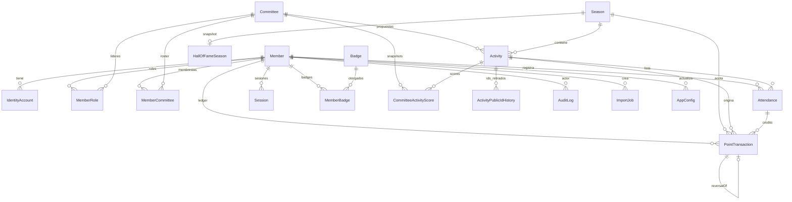

# Modelo de datos

Fuente: `prisma/schema.prisma`. Proveedor: **PostgreSQL**. IDs internos: `cuid()`. El id de negocio en URLs públicas de actividad es `Activity.publicId` (nanoid 10, alfabeto `[0-9a-z]`), nunca el `id` interno (ADR-009).

Migraciones:

1. `prisma/migrations/20260819004625_init/migration.sql` — esquema base.
2. `prisma/migrations/20260819010000_partial_uniques/migration.sql` — uniques parciales.
3. `prisma/migrations/20260819120000_p1_p3_features/migration.sql` — magic link, propuestas, QR dinámico, historial de `publicId`, `periodKey` de badges.

`prisma/migrations/migration_lock.toml` fija `provider = postgresql`.

El seed (`prisma/seed.ts`) borra tablas en orden de FKs, crea config, 17 comités, temporada `2026-2` ACTIVE y `2026-1` CLOSED con Hall of Fame sintético, admin `gh.general@<dominio>`, líder GEMIS, ~50 integrantes, actividades y badges. Dominio de correo: primer valor de `INSTITUTIONAL_EMAIL_DOMAINS`.

## Diagrama de entidades

## Uniques parciales (PostgreSQL)

Definidos en SQL, no como `@@unique` de Prisma (Prisma no expresa `WHERE`):

| Índice | Tabla | Predicado | Invariante |
| --- | --- | --- | --- |
| `Season_one_active` | `Season` | `status = 'ACTIVE'` | Como máximo una temporada activa (ADR-004) |
| `MemberCommittee_one_active` | `MemberCommittee` | `isActive = true` | Una membresía viva por par integrante/comité; el histórico (`isActive=false`) sí se acumula |
| `PointTransaction_one_activity_award` | `PointTransaction` | `attendanceId IS NOT NULL AND type = 'ACTIVITY'` | Un crédito `ACTIVITY` por asistencia (idempotencia del ledger) |
| `MemberRole_global_unique` | `MemberRole` | `committeeId IS NULL` | Un `ADMIN` o `MEMBER` global por integrante |
| `MemberRole_committee_unique` | `MemberRole` | `committeeId IS NOT NULL` | Un `COMMITTEE_LEADER` por par integrante/comité |

## Enums

| Enum | Valores | Uso |
| --- | --- | --- |
| `MemberType` | `NEW`, `ACTIVE` | Tableros de ranking separados. No es el estado de cuenta. |
| `MemberStatus` | `ACTIVE`, `INACTIVE` | Login y ranking solo `ACTIVE`. Inactivar destruye sesiones. |
| `RoleCode` | `MEMBER`, `COMMITTEE_LEADER`, `ADMIN` | ADMIN = GH General. Leader va con `committeeId`. |
| `CommitteeStatus` | `ACTIVE`, `INACTIVE` | Scoring solo comités `ACTIVE`. |
| `SeasonStatus` | `UPCOMING`, `ACTIVE`, `CLOSED` | Cerrar no borra datos; dispara Hall of Fame. |
| `ActivityStatus` | `DRAFT`, `OPEN`, `CLOSED`, `PROCESSED`, `CANCELLED` | Solo `OPEN` + ventana de registro acepta auto-registro. |
| `ActivityType` | `GENERAL`, `SPORTS`, `TALK`, `WORKSHOP`, `SOCIAL`, `OTHER` | Metadato; no cambia la fórmula de puntos. |
| `AttendanceMode` | `OPEN_LINK` | Único valor; no hay otro modo implementado. |
| `ApprovalMode` | `AUTO`, `MANUAL` | AUTO acredita al registrar; MANUAL deja `PENDING`. |
| `AttendanceStatus` | `PENDING`, `APPROVED`, `REJECTED`, `CANCELLED` | Transiciones en `attendance-credit.ts`. |
| `AttendanceSource` | `QR`, `LINK`, `ADMIN`, `IMPORT`, `MICROSOFT_FORMS` | Auditoría de origen. |
| `PointTransactionType` | `ACTIVITY`, `MANUAL_ADJUSTMENT`, `BONUS`, `PENALTY`, `REVERSAL` | Ledger. |
| `AuthProvider` | `EMAIL_OTP`, `MICROSOFT_ENTRA` | Cuentas en `IdentityAccount`. |
| `AuthChallengeKind` | `OTP`, `MAGIC_LINK` | Un login crea ambos. |
| `CommitteeCreditStrategy` | `FULL_CREDIT`, `FRACTIONAL_CREDIT` | Score de comité; default FULL_CREDIT (ADR-006). |
| `BadgeType` | `STREAK`, `POINTS`, `TOP`, `MVP`, `LEADER` | Catálogo de badges. |

## Modelos

### Member (Integrante)

Persona de la organización. Identidad de negocio: `institutionalEmail` único, normalizado a minúsculas.

| Campo | Tipo | Semántica |
| --- | --- | --- |
| `id` | cuid | Interno. No va en rankings públicos. |
| `fullName` | string | Orden visual de empates en ranking. |
| `institutionalEmail` | unique | Login OTP y matching Entra. |
| `memberType` | NEW/ACTIVE | Tablero. Un cambio a mitad de temporada mueve de tablero con el mismo saldo (ADR-008). |
| `status` | ACTIVE/INACTIVE | Inactivo no entra ni aparece en ranking. |

Índices: `(status, memberType)`, `fullName`.

Relaciones: cuentas, roles, membresías, asistencias, ledger, sesiones, badges, actividades creadas, auditoría, imports, configs.

No hay columna `points`: el total es `SUM(PointTransaction.points)` por temporada.

### IdentityAccount

Canal de autenticación vinculado a un `Member`. Un integrante puede tener `EMAIL_OTP` y `MICROSOFT_ENTRA` a la vez.

| Campo | Semántica |
| --- | --- |
| `provider` + `providerUserId` | Unique. OTP: email. Entra: `oid` de Microsoft. |
| `microsoftOid` / `microsoftTid` | Solo Entra. El `oid` no es el id de negocio. |

`onDelete: Restrict` sobre Member.

### MemberRole

Rol asignado. `MEMBER` y `ADMIN` tienen `committeeId` nulo. `COMMITTEE_LEADER` exige `committeeId`.

Invariante de aplicación: no se puede quitar el último ADMIN (`setMemberRoles` en `members.ts`).

### Committee

Grupo de trabajo. `slug` único (vía `slugify` en `src/lib/text.ts`). Color hex para UI. Default `#1e3a5f`.

### MemberCommittee

Membresía **histórica**. `joinedAt` / `leftAt` / `isActive`. El numerador del score de comité usa membresías vigentes en `Attendance.registeredAt` (ADR-007), no solo `isActive` actual. El denominador al cerrar la actividad se congela en el snapshot.

### Season (Temporada)

Ventana de scoring. `startDate`/`endDate` tipo `Date`. Unique parcial: una sola `ACTIVE`. Relación 1:1 opcional con `HallOfFameSeason`.

### Activity (Actividad)

Evento que puede otorgar GH Points.

| Campo | Semántica |
| --- | --- |
| `publicId` | Unique. URL `/a/{publicId}`. |
| `seasonId` | Restrict. |
| `individualPoints` | Entero acreditado al aprobar asistencia. |
| `registrationStart` / `registrationEnd` | Ventana; se compara con `new Date()` del servidor. |
| `approvalMode` | AUTO o MANUAL. |
| `status` | Ciclo de vida. |
| `committeeId` | Opcional; las propuestas de líder lo llenan. |
| `needsApproval` | `true` mientras está en cola (`DRAFT` propuesto). |
| `requireAttendanceToken` | QR dinámico. |
| `attendanceTokenHash` | SHA-256 del token + activityId + SESSION_SECRET. El token en claro se muestra una vez al rotar. |
| `createdById` | Quién la creó o propuso. |

Índices: temporada+status, `startsAt`, ventana de registro, cola (`needsApproval`, `status`), `committeeId`.

### ActivityPublicIdHistory

Al rotar QR, el `publicId` viejo se guarda aquí y deja de resolver en `getActivityByPublicId` (busca solo el actual). Los IDs anteriores «ya no funcionan» (texto en admin).

### Attendance (Asistencia)

Una fila por par actividad/integrante (`@@unique([activityId, memberId])`).

| Campo | Semántica |
| --- | --- |
| `status` | PENDING → APPROVED/REJECTED/CANCELLED. APPROVED → REJECTED/CANCELLED. REJECTED y CANCELLED son terminales para este módulo. |
| `registeredAt` | Instante usado para membresía histórica en scoring. |
| `source` | QR si el referer no incluye `/a/`; LINK si sí (heurística en la página pública). |

Invariante de crédito (CONTEXT.md): `APPROVED` ⇔ una fila `ACTIVITY` no revertida para esa asistencia; cualquier otro estado ⇔ neto cero. Re-aprobar tras rechazo/anulación no está permitido; la corrección es `MANUAL_ADJUSTMENT`.

### PointTransaction (Ledger)

Fuente de verdad de puntos (ADR-003). **No se edita ni se borra.**

| Campo | Semántica |
| --- | --- |
| `points` | Entero; reversión = negativo del original. |
| `type` | Ver enum. |
| `reason` | Obligatorio en asignaciones manuales. |
| `reversalOfId` | Unique: a lo sumo una reversión por transacción. |
| `attendanceId` | Unique parcial para `type=ACTIVITY`. |

Índices: `(seasonId, memberId)`, `(seasonId, createdAt)`, `(memberId, createdAt)`, actividad, asistencia.

### CommitteeActivityScore

Snapshot por comité y actividad. Unique `(committeeId, activityId)`.

| Campo | Semántica |
| --- | --- |
| `eligibleMemberCount` | Denominador; se congela si `frozen` y la actividad está CLOSED/PROCESSED. |
| `attendeeCredit` | Decimal 12,6. Numerador (créditos, no cabezas). |
| `participationRate` | `credit / eligible` (0 si eligible=0). |
| `creditStrategy` | Estrategia usada al computar. |
| `frozen` | `true` cuando la actividad está CLOSED o PROCESSED. |

Score de temporada de un comité = media simple de `participationRate` en actividades CLOSED/PROCESSED (ADR-005). Ranking **lee** estos snapshots; scoring **escribe**.

### AuditLog

Append-only. `action` string libre (p. ej. `MEMBER_CREATED`, `ATTENDANCE_APPROVED`). `before`/`after` JSON. IP opcional. Actor nullable (`SET NULL`).

### AppConfig

Clave/valor JSON. Semilla: `committee_credit_strategy` = `FULL_CREDIT`, `timezone` = `America/Bogota`. La UI de settings solo edita la estrategia. La zona horaria de display sale de `APP_TIMEZONE` en env (`src/lib/dates.ts`), no de esta fila.

### AuthChallenge

Reto de login. `codeHash` (OTP ligado a email+secret, o hash del magic token). TTL `OTP_TTL_SECONDS`. `attempts` / `maxAttempts` (5). Rate limit: cuenta filas OTP recientes por email e IP.

### Session

Cookie opaca: el valor es el token en claro; en DB está `tokenHash` SHA-256. TTL 14 días. `onDelete: Cascade` con Member. Unique `tokenHash`.

### Badge / MemberBadge

Catálogo + otorgamientos. Unique `(memberId, badgeId, seasonId, periodKey)`. `periodKey` vacío para badges de temporada; `yyyy-MM` para MVP mensual. Seed crea: `streak`, `500-points`, `top-10`, `monthly-mvp`, `committee-leader`.

### HallOfFameSeason

Un snapshot por temporada cerrada. `top3Active` / `top3New` / `top3Committees` / `stats` en JSON (nombres, no emails ni ids internos). Los campos `activeWinnerId`, `newWinnerId`, `committeeWinnerId` existen en schema pero `persistHallOfFameSnapshot` los deja en `null` (privacidad).

### ImportJob

Trabajo de importación. `type`: `MEMBERS` o `FORMS`. `status`: `PREVIEWED`, `CONSUMED`, `COMMITTED`. La vista previa vive en `summary` JSON; al confirmar se marca consumida para no reutilizarla.

## FKs y borrado

Casi todo es `onDelete: Restrict` (no se borra un integrante con ledger). Excepciones: `Session` cascade con Member; `ActivityPublicIdHistory` cascade con Activity; `AuditLog.actor` y `AppConfig.updatedBy` SET NULL.

## Semántica que no está en columnas

- Totales individuales: agregación del ledger.
- Niveles (Novato…Élite): calculados al leer (`levels-pure.ts`), no persistidos (ADR-017).
- Ranking oficial: temporada `ACTIVE`, miembros `status=ACTIVE`, tableros por `memberType`.
- El enum `AttendanceMode` no ramifica código: siempre enlace abierto.
